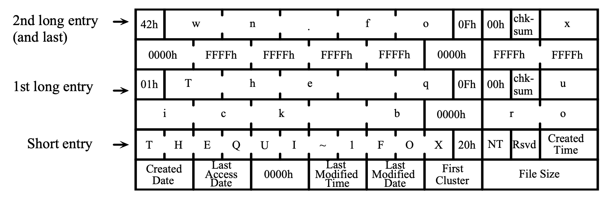
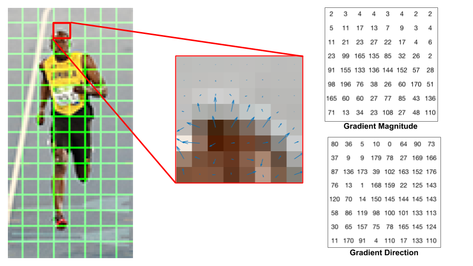
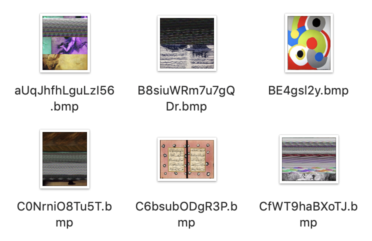

# M5: File Recovery (frecov)

## 1. 背景

### 1.1 磁盘的格式化

操作系统为我们提供了工具 “格式化” 存储介质——通常默认的选项是 “快速格式化”；MacOS 比较贴心地提供了更多的选项，例如更慢但更安全的选项。在课堂上，我们也展示了 mkfs.fat (将文件系统格式化成 FAT 格式) 工具在格盘时的系统调用序列。这解释了 “为什么 1TB 的磁盘只要格式化一秒钟”——把存储设备上的文件系统看成是一个数据结构 (例如，不妨假设成是大家熟悉的二叉树)，你不难理解你只要破坏数据结构的 “根节点”，也就是

```c
root->left = root->right = NULL;
```

数据结构的其他部分也就永久地丢失了——数据结构就完成了一次完美的 “内存泄漏”。当然，因为整个数据结构都被摧毁，你也可以重置内存分配器 (balloc/bfree) 的状态，这样所有磁盘上的空间就变得可以被分配，磁盘也就 “焕然一新” (被格式化) 了。

### 1.2 格式化磁盘的数据恢复

快速格式化紧接着就带来了一个问题：快速格式化 (指针赋值) 也意味着你能通过遍历存储设备 (内存) 的方式把数据结构找回来：

```c
root->left = find_left();
root->right = find_left();
```

只要恢复出这两个指针，整个二叉树就又回来了！不仅是格式化，我们知道文件系统在实现文件/目录的删除操作时，也只是从文件系统的数据结构中抹去文件相关的信息，并不会实际将每一个保存数据的块删除。这大大增加了文件系统的性能，减少了磁盘的读写数量。这些系统里为了节约时间做出的操作，其实牺牲了一定程度的安全性——我们可以通过 “扫描磁盘” 的方式一定程度地恢复出文件系统中已经被删除的文件。

#### 1.2.1 数据恢复：好的应用场景

让我们来看看一个 Makefile 引发的血案。在某个月黑风高的夜晚，修改了代码，以为 `OBJ_DIR` 这个变量不再使用，遂删除。结果没有料到，Makefile 里还留了这么一手：

```
clean:
    rm -rf ... $(OBJ_DIR)/* ...
```

在另一个月黑风高的夜晚，`make clean` 之后，`rm -rf /*` 开始了……

每个人 (包括 jyy 和 yzh) 都有过在脑抽的时候误删过文件的经历。那可真是相当惨痛的经历——类似的还有把重要数据保存在优盘上，然后文件系统发生了损坏……当然，数据其实并没有从存储器上消失，因此如果有数据恢复的软件，那真是救命了！

> #### 怎样保护重要数据的可靠性？
>
> 自从用上了 git、养成按时 git push 的习惯之后，重要数据的损失就降低到最小了——至少可以保证在任何时候，如果瞬间某台电脑彻底损坏，损失的工作量不会超过几个小时。以下是贴在实验室门上的忠告 (你在计算机楼 809 的门上可以看到下图的打印版)。每当 git push 成功以后，心里都会觉得很踏实。
>
> 

#### 1.2.2 坏的应用场景


数据对每个人来说都是非常宝贵的。在数码相机等设备的存储卡中，FAT (exFAT) 这样的文件系统依然广泛使用。再加上 “追加写入” 的特点，大部分照片是直接连续存储在存储卡中，也意味着相片是相对更容易恢复的。如果你不小心删除了一整天拍摄的照片，当你恢复出它们的时候，一定感受到文件系统设计者的不杀之恩。

但同时，这也意味着不法分子有了可乘之机。文件系统中总有一些你不想让别人看到的文件——你不仅想在文件系统中删除它，还希望别人即便拿到你的磁盘做数据恢复，也不能恢复出文件的内容：明文存放了各大网站密码的文件、不能见人的照片……别有用心的人用 “修电脑” 摧毁了冠希哥和一众演艺界明星的事业和生活。格式化过的 SD 卡、恢复出厂设置的手机，都可能是不法分子敲诈勒索的筹码。

> #### 文件粉碎
>
> 因此，有些系统软件提供了 “文件粉碎” 的功能。文件粉碎的一个实现方法是用覆盖写的方式把文件的数据清除 (即找到磁盘上所有存储了该文件数据的块，并且向块内写入随机数据)，然后再删除。
>
> 对于 HDD 上的文件系统，通常这样的 “文件粉碎” 就是相当安全的。但随着存储技术的发展，底层的文件系统 (甚至是 Flash SSD 的 FTL) 可能采用 copy-on-write 方式保存数据，从而在硬件上保留文件的拷贝。虽然恢复它们需要很大的代价，但安全的 “文件粉碎” 变得更加困难。使用加密的文件系统是更好的办法。

当然，能恢复数据也带来了滥用的可能。试想你的手机被盗或被作为二手处理掉之后，能够从手机的内部存储/存储卡中恢复出先前的文件——重要信息、聊天记录、照片……幸运的是，随着文件系统加密(在文件系统层写入数据前即执行数据的加密)的普及，大家越来越不用担心这些问题了。

## 2. 实验描述

在这个实验中，我们要求你编写程序，best-effort 恢复经过了快速格式化的文件系统中 bmp 格式的**图片**即可 (即尽可能地抢救文件即可)。

你需要实现命令行工具 `frecov`，给定一个格式化过的 FAT32 文件系统镜像，假设其中绝大部分文件都是以 BMP 格式存储的。请你尽可能地从文件系统中恢复出完整的图片文件。命令行工具使用方法：

frecov FILE

其中 FILE 是一个 FAT-32 文件系统的镜像。每恢复一张图片文件 (完整的文件，包含 BMP 头和所有数据)，调用系统中的 `sha1sum` 命令获得它的校验和，在标准输出中逐行输出图片文件的校验和以及你恢复出的文件名。只有校验和与文件名**都恢复正确且一致**，才被认为正确恢复了一个文件。

### 2.1 图片恢复任务

这个实验并不是让大家真正编写一个优秀的 undelete 工具。如果做到的话，你就可以开公司挣大钱了！EasyRecovery 曾经一度挣到很多钱——如果你穿越回 2000 年，对文件系统有一些了解，你也可以挣大钱！实验的目的是为了让大家体验一下：

- 仔细阅读 FAT 文件系统的 specification。因为手册体量不大，精读手册基本在你的掌控范围。这将给你未来阅读更长的手册打下良好的基础；
- 写代码分析文件系统镜像，尤其体会 mmap 带来的便利；
- 写代码分析一个实际的二进制文件：我们选取的是分析 BMP 格式的图片文件；
- 想一个 (也许是非常简单) 的算法恢复出文件系统中的 BMP 文件。也许能 work 的算法比你想象更简单。

我们对这个问题做了相当的简化，首先，我们保证我们的文件系统镜像使用如下方法创建的 (主要使用 `mkfs.fat` 工具):

1. 创建一个空文件 (例如在下面的例子中，文件系统镜像的大小是 64 MiB)，例如 `fs.img`

    ```bash
    $ cat /dev/zero | head -c $(( 1024 * 1024 * 64 )) > fs.img
    ```

2. 在这个空间文件上创建 FAT-32 文件系统

    ```bash
    $ mkfs.fat -v -F 32 -S 512 -s 8 fs.img
    mkfs.fat 4.1 (2017-01-24)
    WARNING: Not enough clusters for a 32 bit FAT!
    fs.img has 64 heads and 32 sectors per track,
    hidden sectors 0x0000;
    logical sector size is 512,
    using 0xf8 media descriptor, with 131072 sectors;
    drive number 0x80;
    filesystem has 2 32-bit FATs and 8 sectors per cluster.
    FAT size is 128 sectors, and provides 16348 clusters.
    There are 32 reserved sectors.
    Volume ID is 6f71a2db, no volume label.
    ```

    注意我们使用的选项：`-S 512` 表示 sector 大小是 512, `-s 8` 表示每个 cluster 有 8 个 sectors。这个信息对大家正确编程非常重要——如果你想偷懒，可以假设我们总是用这种方式创建文件系统镜像 (即硬编码这个信息)，但我们更推荐你阅读手册，写出兼容 FAT 标准的 frecov。

    如果你用 `file` 命令，可以查看到镜像已经被正确格式化：

    ```bash
    $ file fs.img
    fs.img: DOS/MBR boot sector, code offset 0x58+2, OEM-ID "mkfs.fat", sectors/cluster 8, Media descriptor 0xf8, sectors/track 32, heads 64, sectors 131072 (volumes > 32 MB), FAT (32 bit), sectors/FAT 128, serial number 0x166d2b7d, unlabeled
    ```

3. 挂载新创建的文件系统，并创建根目录下的 `DCIM` 目录

    ```bash
    $ mount fs.img /mnt/
    $ mkdir /mnt/DCIM
    ```

4. 此时，文件系统已被挂载 (mount) 到 `/mnt` 目录下，并且有一个 “DCIM” 目录。然后我们会在 DCIM 目录中进行很多次如下的文件操作。尽管图片文件分辨率、大小可能不同，但都**保证是真实世界中有意义的图片** (而不是随机数生成器生成的随机数据)：

    - 向 DCIM 中复制图片文件 (文件名为大/小写字母和数字、减号、下划线，以 “.bmp” 或 “.BMP” 结尾)
    - 删除 DCIM 中的图片文件
    - ……
    - (反复操作之后，文件系统中可能存在一些碎片化的情况)

5. 卸载 (unmount) 文件系统镜像后，我们会重新进行一次文件系统的快速格式化，通过使用同样的选项再次调用 `mkfs.fat`：

    ```bash
    $ mkfs.fat -v -F 32 -S 512 -s 8 fs.img
    ```

此时的 `fs.img` 就是你要恢复的文件系统镜像。此外，你可以假设所有的 BMP 文件，都是使用 Python PIL 库创建的 24-bit 位图：

```bash
$ file 0M15CwG1yP32UPCp.bmp 
0M15CwG1yP32UPCp.bmp: PC bitmap, Windows 3.x format, 364 x 448 x 24
```

### 2.2 输出格式

试图恢复出 DCIM 目录下尽可能多的图片文件。对于每个恢复出的文件，输出一行，第一个字符串是该文件的 SHA1 fingerprint (通过调用系统的 `sha1sum` 命令得到)，然后可以输出一个或多个空格，接下来输出图片的文件名，例如：

```
d60e7d3d2b47d19418af5b0ba52406b86ec6ef83  0M15CwG1yP32UPCp.bmp
1ab8c4f2e61903ae2a00d0820ea0111fac04d9d3  1yh0sw8n6.bmp
1681e23d7b8bb0b36c399c065514bc04badfde79  2Kbg82NaSqPga.bmp
...
```

你的输出中可能带有一些调试信息，我们会忽略它 (不要输出太多调试信息，否则会导致 output limit exceeded)，但请保证你的 SHA1 fingerprint 和输出的文件名独占一行。

## 3. 正确性标准

> 请严格按照 2.2 中规定的输出格式输出 (40 字节的 sha1sum, 之后是文件名)。

### 3.1 评测说明

我们会使用不超过 128 MiB 的镜像文件来测试你的文件，然后：

- 我们有 10s 的 Time Limit (128 MiB 的镜像有 30s 的 Time Limit)。如果你的程序速度较慢，你可以考虑在每恢复出一个图片后打印，并 flush stdout (超时的程序会被终止，但只要恢复的文件名/图片正确即判定为正确)，建议使用内存不要超过 1 GB；
- 超过 10% 的文件名被恢复正确，可以通过所有 easy test cases；
- 超过 50% 的文件名被恢复正确，可以通过一个 hard test case；
- 超过 75% 的文件名和 50% 的图片被恢复正确，可以通过所有 hard test cases。

不必把图片恢复任务想象得太困难——大文件在文件系统中是倾向于连续存储的，就像在下面参考镜像的 FAT 表中看到的那样。

此外，Online Judge 会把你的输出作为一个 utf-8 字符串进行读取。因此，如果你输出了非法的字符 (例如不经检查地输出恢复的文件名，但其实并不是合法的文件名)，将有可能导致解码失败，得到 Invalid Output。

### 3.2 参考镜像

我们为大家提供了一个参考文件系统镜像。实际测试的图像来自同一个数据集 (WikiArt)，但我们可能会挑选不同的图片、赋予文件其他的随机名称或改变图像的大小，但所有随机的参数都与我们给出的镜像相同 (例如随机的文件名长度的分布等)。镜像请[点这里下载](https://box.nju.edu.cn/f/0764665b70a34599813c/?dl=1)。

镜像下载完毕后可以直接在文件系统中挂载 (你可能需要 root 权限)，这个镜像文件就成为了文件系统的一部分：

```bash
$ mount /tmp/M5-frecov.img /mnt/
$ tree /mnt/
/mnt
└── DCIM
    ├── 0M15CwG1yP32UPCp.bmp
    ├── 1yh0sw8n6.bmp
    ├── 2Kbg82NaSqPga.bmp
    ...
```

你可以查看其中的图片文件，例如 `3DhTVVP9avTrH.bmp` 是下面的图片：


如果你用二进制工具 (例如我们使用的是 xxd) 查看镜像文件，你能发现正确的 FAT 表，以链表的形式保存了每个图像文件的下一个数据块 (在 FAT 系统中，是 cluster 的编号)：

```
00004000: f8ff ff0f ffff ff0f f8ff ff0f 1720 0000  ............. ..
00004010: 0500 0000 0600 0000 0700 0000 0800 0000  ................
00004020: 0900 0000 0a00 0000 0b00 0000 0c00 0000  ................
00004030: 0d00 0000 0e00 0000 0f00 0000 1000 0000  ................
00004040: 1100 0000 1200 0000 1300 0000 1400 0000  ................
```

接下来，你可以模拟 Online Judge 在测试你的代码前所做的操作：使用 `mkfs.fat` 快速格式化这个磁盘镜像：

```bash
$ mkfs.fat -v -F 32 -S 512 -s 8 M5-frecov.img
mkfs.fat 4.1 (2017-01-24)
WARNING: Not enough clusters for a 32 bit FAT!
/tmp/M5-frecov.img has 64 heads and 32 sectors per track,
hidden sectors 0x0000;
logical sector size is 512,
using 0xf8 media descriptor, with 131072 sectors;
drive number 0x80;
filesystem has 2 32-bit FATs and 8 sectors per cluster.
FAT size is 128 sectors, and provides 16348 clusters.
There are 32 reserved sectors.
Volume ID is a332d0ad, no volume label.
```

如果你接下来再次挂载这个镜像，将会看到完全空白的目录，仿佛磁盘镜像上的所有文件都被删除了：

```bash
$ tree /mnt/
/mnt/

0 directories, 0 files
```

如果再次查看 `M5-frecov.img` 二进制文件，你会发现分区表已经被 “抹除” 了：

```
00004000: f8ff ff0f ffff ff0f f8ff ff0f 0000 0000  ................
00004010: 0000 0000 0000 0000 0000 0000 0000 0000  ................
00004020: 0000 0000 0000 0000 0000 0000 0000 0000  ................
00004030: 0000 0000 0000 0000 0000 0000 0000 0000  ................
00004040: 0000 0000 0000 0000 0000 0000 0000 0000  ................
```

虽然操作系统已经看不到磁盘上的文件了，但如果你仔细地搜索 (使用 “查找” 工具) 一下，还是可以发现一些蛛丝马迹：

```
00025ae0: 4250 0043 0070 002e 0062 000f 0089 6d00  BP.C.p...b....m.
00025af0: 7000 0000 ffff ffff ffff 0000 ffff ffff  p...............
00025b00: 0130 004d 0031 0035 0043 000f 0089 7700  .0.M.1.5.C....w.
00025b10: 4700 3100 7900 5000 3300 0000 3200 5500  G.1.y.P.3...2.U.
00025b20: 304d 3135 4357 7e31 424d 5020 0064 2b5a  0M15CW~1BMP .d+Z
00025b30: ac50 ac50 0000 2b5a ac50 6915 3677 0700  .P.P..+Z.Pi.6w..
```

这好像以某种格式 (FAT32 的 directory entry) 存储了 “`0M15CwG1yP32UPCp.bmp`” 相关的信息。此外，bitmap 图片文件的文件头也被完整地在数据区里保留下来：

```
000fb000: 424d 2ecf 0f00 0000 0000 3600 0000 2800  BM........6...(.
000fb010: 0000 0202 0000 9f02 0000 0100 1800 0000  ................
000fb020: 0000 f8ce 0f00 c40e 0000 c40e 0000 0000  ................
000fb030: 0000 0000 0000 7d74 9986 7ba3 6c61 8888  ......}t..{.la..
000fb040: 7ea4 8076 9d84 7ca2 766d 9469 6187 6a64  ~..v..|.vm.ia.jd
```

你的 `frecov` 会被调用，运行在这个格式化后的镜像上，然后预期会得到一定的输出：

```
d60e7d3d2b47d19418af5b0ba52406b86ec6ef83  0M15CwG1yP32UPCp.bmp
...
```

如果你挂载没有被格式化过的 `M5-frecov.img`，你可以查看所有图片的 sha1sum，从而检查你正确恢复了哪些图片。

```bash
$ cd /mnt/DCIM && sha1sum *.bmp
d60e7d3d2b47d19418af5b0ba52406b86ec6ef83  0M15CwG1yP32UPCp.bmp
1ab8c4f2e61903ae2a00d0820ea0111fac04d9d3  1yh0sw8n6.bmp
1681e23d7b8bb0b36c399c065514bc04badfde79  2Kbg82NaSqPga.bmp
aabd1ef8a2371dd64fb64fc7f10a0a31047d1023  2pxHTrpI.bmp
...
```

## 4. 实验指南

### 4.1 FAT32 文件系统

我们提供了一份 [Microsoft FAT Specification](http://jyywiki.cn/pages/OS/manuals/MSFAT-spec.pdf) 的 local copy。你可以试一试：不借助任何其他有关 FAT 的 blog post, tutorial 和代码，你会渐渐觉得 RTFM 不那么困难了。如果你依然感到困难，可以回看视频并参考课堂上的实例代码 [fatree.c](http://jyywiki.cn/pages/OS/2022/demos/fatree.c)，但我们**强烈建议大家不要复制其中的代码而是自己编写**，以得到最好的训练。

FAT 文件系统是由一些头部信息 (元数据)、FAT (文件分配表) 和数据 (cluster, 微软的官方翻译是 “簇”) 组成的。如果你做一些分析，你会知道：

1. FAT 文件的头部是可用的——我们用同样的方式进行两次格式化；
2. FAT 表将被清空，此部分的数据相当于全部丢失；
3. 数据区几乎没有变化——我们执行的是 “快速” 格式化。

接下来，你就可以开始照抄手册，进行 FAT 文件系统的解析了，例如手册已经详细地规定好了 FAT32 文件系统前 512 个字节的格式，你不妨把它解释成一个结构体：

```c
struct fat32hdr {
  u8  BS_jmpBoot[3];
  u8  BS_OEMName[8];
  u16 BPB_BytsPerSec;
  u8  BPB_SecPerClus;
  ...
  u8  __padding_1[420];
  u16 Signature_word;
} __attribute__((packed));
```

“抄手册” 很容易抄错？不要忘记 `_static_assert(sizeof(struct fat32hdr) == 512)`。然后你会神奇地发现，如果你使用 mmap 系统调用将磁盘映射到地址空间中，例如返回 `disk`，那么你就可以直接访问磁盘镜像头部的元数据了：

```c
panic_on(sizeof(struct fat_header) != 512, "bad header");
panic_on(disk->signature != 0xaa55, "not a valid fat");
cluster_sz = disk->BPB_BytsPerSec * disk->BPB_SecPerClus;
```

这个时候，你就可以真正在内存里任意 “把玩” 这个数据结构了。做一些实验，看看能不能在文件系统中找到一些有用的数据。记得我们在课堂上解释过，文件系统是基于 block I/O 封装的数据结构。当我们完成 mmap 以后，它就真的是一个内存里的数据结构了，除了有些 “指针” 需要经过额外的计算才能得到它指向的地址。

### 4.2 BMP 文件格式

为了完成实验，你还需要了解 BMP 文件的格式。为了锻炼大家独立思考、查找资料的能力，关于 BMP 文件的细节请 STFW。好消息是这部分你们需要查阅的资料很简单，由于我们的 BMP 都是以同样的方式创建的，你可以忽略其中大部分的 fields，只需关注：

1. bitmap 存储区域开始的 offset；
2. 图片的宽度和高度。

### 4.3 扫描 Clusters

在你对 FAT32 文件系统有了足够的认识以后，你会发现在我们的问题中，数据区的 clusters 分成以下几种情况：

1. 目录文件，存储若干目录项 (directory entry)，对应手册 Sections 6 和 7 描述的内容。注意 Section 7 是非常重要的，因为你必须恢复出完整的文件名；
2. BMP 文件的头部，以 “`424d` (`BM`)” 开头；
3. BMP 文件的实际数据，按照 3 字节一组按顺序存储了图片中的所有像素；
4. 未使用的 cluster。

在 FAT 表被清除后，我们已经无法根据 FAT 恢复出目录的树状结构了。因此接下来我们要做的是一个分类问题：我们需要依次扫描磁盘中的所有 clusters，并将它们标记为以上 4 类。你不需要使用任何机器学习——你可以手工硬编码一些特征，就足够完成识别了，例如目录文件里总是包含大量的 “BMP” 字符，这是数据和 bitmap 文件头所没有的。你不需要做得 100% 准确，因为你只要恢复相当一部分文件即可；但你要小心地编写健壮的代码，使得分类错误发生时程序不会发生太大的问题——你的程序可能在分类错误时 (例如将位图数据解析为目录时) 因为非法的输入而 crash。

### 4.4 图片数据恢复

接下来，你需要的是恢复目录文件中的目录项，从而得到文件名。手册上对目录文件中的目录项给出了精确的定义。当你需要写代码解析文件时，手册就比 blog posts 靠谱得多了。在这里，你要小心目录项可能跨过 cluster 的情况——当然简单起见，你可以放弃这个文件的恢复，只要你的程序不会因此 crash 就行。



当你恢复出一个目录项以后，你不仅得到了正确的文件名，而且得到了一个非常有用的信息：这个文件名对应的 cluster ID，你根据这个块的编号就可以找到一个保证是 BMP header 的 cluster——你可以和你在扫描 clusters 时的分类结果进行匹配，如果这个 cluster 不是一个 bitmap header，你可能需要放弃这个文件的恢复。

接下来剩下的工作就是恢复图片的剩下部分了！最简单地，你可以假设图片剩下的部分 (clusters) 都连续地存储在文件中。因此你只要正确知道文件的大小 (这个信息在目录项中也有)，你就可以直接恢复出一张图片了。

如果想要更进一步，就需要做出一些数学上的分析。我们丢失的是 FAT 表，也就是所有的 “链接” 关系。例如，我们可以把文件恢复建模成一个图问题：

- 建立有向图 G，其中每一个 cluster 是一个顶点。
- 对于两个顶点 u, v，建立一条边 u→v，权值是 u、v 作为同一个文件连续两块的概率。
- 图中每一条 “概率足够大” 的路径就对应了一个文件。

在这个模型下，你可以提出很多有趣的算法来尝试恢复文件——注意你可以对同一个文件恢复出多种可能性。同时，你也可以采取一些启发式的优化，例如假设文件的大部分都是连续存储的。在构建图的过程中，我们也可以针对 bitmap 连续存储像素的特性去判断两个 cluster 是否处于同一张图片：现实世界中的图片大多是 “连续” 变化的，即绝大部分相邻的像素，像素值都不会发生剧烈的变化。这样的想法其实对应了对图像在二维空间上进行求导 (“gradient”)，而大部分像素的导数都是很小的：



这构成了 SIFT 算法的核心，并且在计算机视觉领域统领了数十年，直到深度学习技术的出现——卷积能够自动地学习出图片梯度的信息，并在此基础上提取出更为有用的高层特征。

### 4.5 计算校验和

终于，你得到了文件名、文件的大小和文件的所有数据——是时候把它的校验和输出了。在这个实验中，你需要调用外部工具 sha1sum 计算校验和。sha1sum 的命令行工具可以从 stdin (或者文件) 读取数据，然后把 hash digest 输出到标准输出：

```bash
$ echo "Hello, World" | sha1sum
4ab299c8ad6ed14f31923dd94f8b5f5cb89dfb54  -
```

sha1sum 是一种计算字节序列 “指纹” 的算法。指纹 (fingerprint) 也称为校验和 (checksum)，它是一个单向的 hash function H，能把一个很大空间里的字符串映射到很小的空间中 (计算 H(x))，并且目前而言，给定一个 fingerprint 后的字符串 t，人类很难计算出一个字符串 x 满足 H(x)=t。指纹能在不传输整个文件的前提下，快速比较两个文件是否相等。除了校验文件的完整性之外，指纹还可以用来做数据的去重——例如大家在即时通信软件中传送文件 (例如 QQ) 时，服务器会用校验和检查是否已经存在文件的副本，如果是就可以立即结束传输 (所以你们在上传一些别人可能已经上传过文件时会出现大文件 “秒传” 的情况)。

如果你不希望在这个实验里重复 pipe-fork-execve 的流程，popen 可以很好地解决这个问题：我们可以把恢复出的图像写入文件系统中的任何位置 (当然是某个临时目录)，然后用 popen 读取 sha1sum 的输出到缓冲区中，然后再将它输出：

```c
fp = popen("sha1sum /tmp/your-tmp-filename", "r");
panic_on(fp < 0, "popen");
fscanf(fp, "%s", buf); // Get it!
pclose(fp);
```

### 4.6 调试你的程序

这次的程序稍微有些长。你可能需要一些 logging 才能比较好地帮助你完成任务。记录日志时要小心干扰 Online Judge。注意你依然只能编写一个 `.c` 文件，因此注意你的代码风格，适当地使用 IDE 和代码折叠能最大程度地提高你的编码效率。

除此之外，这个实验中一个常见的问题是你很多时候不知道你的程序 “为什么” 没有恢复出正确的图片——虽然你知道每一个图片的 sha1sum，但这些数值看起来就像是随机的数字，只要你有一个字节的差异，它们就会看起来完全不同。

一个调试的好办法是 “visualization”: 在调试时将恢复出的图片输出到某个目录中 (小心不要把图片文件放到 Git repo 中)，然后直接 “肉眼” 观察恢复的结果，你会发现有些图片得到了正确的恢复，有些则没有。你能解释为什么会看到下面那样错误的图形吗？

