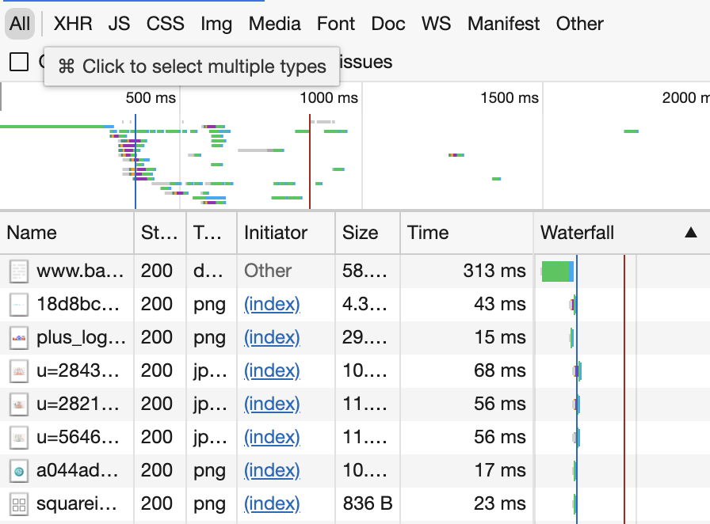
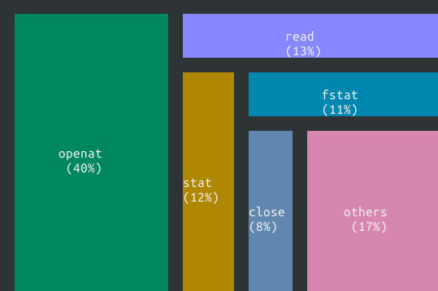

# M3: 系统调用 Profiler (sperf)

## 1. 背景

大家已经对 “程序/计算机系统就是状态机” 有了很深入的认识。我们也展示了很多能够观察状态机执行的工具：gdb (step/stepi 单步执行)、strace (查看系统调用)。在这个实验中，我们就会更加近距离地和这些工具接触，使用课堂上学过的进程管理 API，去启动一个这样的工具，并获得它们的输出。具体而言，你可以实现一个属于自己的系统调用 profiler，它甚至可以和图形界面里的一样 cool：


(约 100 行代码的参考实现。但你不需要实现得那么花哨)

### 1.1. Trace 工具

操作系统里提供了足够的工具满足你的好奇心——那就是踪迹工具 trace，我们已经在课堂上介绍过了。例如，使用 strace 追踪程序执行时的系统调用。当然，你可以考虑如何实现一个 strace——你可以借助 gdb，在每一条 syscall 指令之前停下来。这可以通过单步执行实现；也可以通过在每个 syscall 指令上打断点或 patch ([dsu.c](http://jyywiki.cn/pages/OS/2022/demos/dsu.c)) 实现；操作系统也可以提供 API 帮助我们实现 trace。

Trace 工具是系统编程时非常常用的问题诊断工具。根据调试理论，trace 在一定程度上反应了程序执行的流程，因此可以帮助你缩小 bug 所在的范围 (回顾调试的目标是找到第一个发生 error 的程序状态)；此外，trace 中额外的信息还能帮助诊断性能等问题 (例如你的程序是否在某个系统调用上花去了大量的时间)。除了我们熟知的 strace, ltrace，其实 trace 广泛地存在于计算机系统的各个层面上：

- 操作系统内核 (例如 Linux) 提供了多种 trace 机制，有兴趣的同学可以参考 [ftrace](https://www.kernel.org/doc/html/latest/trace/ftrace.html)；

- 浏览器的开发者模式 (F12 控制台，想必大家已经用它查看过课程网站的 slides 是如何实现的了) 中，能够 trace 网络等请求——别小看它，这也是一种 trace！而且它对调试网站的功能性问题和性能问题都是至关重要的；

    

- 通过 Java Virtual Machine Tool Interface (JVMTI) 在 Java 虚拟机中创建 agent，收集程序执行的信息。

### 1.2. 基于 Trace 的 Profiling

如果我们对 trace 进行一定的分析，将它们的结果更好地展示出来，就更棒对吧！Trace 是对程序执行中某一部分的忠实记录——因此有时候它可能会很长，一个程序执行数百万次系统调用是非常常见的行为。

我们不妨考虑一个场景：大家在做操作系统 Online Judge 的时候，偶尔会发生 Time Limit Exceeded。如果是问题求解或算法课，你一定是觉得是算法实现错误、复杂度分析错误、死循环等导致的。但如果你在编写实际的代码时发生这种情况，有可能并不是你的算法花费了最多的时间，而是系统调用。

在这个实验中，你会借助 strace 实现一个程序的**性能诊断**工具 (虽然 strace 的设计意图本身并不主要是为了诊断性能问题)，它能够帮助你找到程序运行时耗时最多的那些系统调用，从而找到程序的性能瓶颈。我们基于 trace 实现一个 system call [profiler](https://en.wikipedia.org/wiki/Profiling_(computer_programming)) 分析系统调用的性能信息——而且这件事一点也不难，我们只要分析 trace 的输出就可以了！

此外，如果你对 “对着终端编程” 感到厌倦，在这个实验里你也许能获得一些乐趣——虽然你仍然在终端中，但你也许可以构建一个不错的 “图形界面”，例如山寨一个 Brendan Gregg 的 [Flame Graph](http://www.brendangregg.com/flamegraphs.html):


## 2. 实验描述

实现命令行工具 `sperf`：

sperf COMMAND [ARG]...

它会在系统中执行 COMMAND 命令 (如果 COMMAND 是以 `/` 开头的绝对路径，则直接执行；否则在 `PATH` 环境变量中搜索到第一个存在且可执行的文件)，并为 COMMAND 传入 ARG 参数 (列表)，然后统计命令执行的系统调用所占的时间。例如执行 `sperf find /` 会在系统中执行 `find /`，并且在屏幕上显示出耗时最多的若干系统调用的时间。

一些假设和约定：

- 输出的形式不限。对于较短时间运行的程序，你可以一次性打印出耗时最多的几个系统调用；对于耗时较长的程序，你需要定期 (如每秒) 打印出系统调用的耗时信息；
- 假设 `COMMAND` 是单进程、单线程的，无需处理多进程 (`fork`) 和多线程 (`clone`/`pthread_create`) 的情况；虽然 strace 明确支持多进程/多线程程序。
- 作为对大家的考验，必须使用 execve 系统调用；使用 glibc 对 execve 的包装 (execl, execlp, execle, execv, execvp, execvpe) 将导致编译错误，但我们鼓励你阅读后者的手册。

> #### 只允许用 execve？
>
> 在终端里，我们输入 “strace” 以后，为什么 `/usr/bin/strace` 会被找到执行？为什么输入 `a.out` 当前目录下的 `a.out` 不会被执行 (必须要 `./a.out`?) 路径的解析是通过 `PATH` 环境变量实现的，如果执行命令，会逐个尝试 `PATH` 环境变量中的路径，直到找不到后才失败。
>
> 在这个实验里，为了强迫大家理解环境变量，我们设置了两个坑：
>
> 1. 必须使用 execve，并且 strace 的可执行文件并不位于 `/usr/bin`，但它的确在 `PATH` 环境变量中的某个目录中。因此如果你直接 `execve("/usr/bin/strace", ...)` 将会失败；
> 2. 必须正确处理传递给子进程的环境变量，否则将在 hard test 发生 Wrong Answer。

例如，在我们的参考实现中，通过在字符终端里绘制系统调用图的方式展示系统调用的耗时 (系统调用所花时间与所占面积成正比)，下图统计了执行 `python -c "print()"` 在各个系统调用上花费的时间。很酷对吧？



我们还可以每隔一段时间更新统计的结果，就像我们在一开头看到的那样：


从上面的图中，我们其实可以得到一些对程序性能的不显然的，增加大家对程序执行的认识：

- 对于 memory intensive 的纯计算型程序，brk 和 munmap 花去了最多的时间
- 对于文件系统遍历，文件系统元数据访问 lstat 和 getdents 花去了最多的时间

当然，作为我们预期你的实现在 100 行左右的单文件 “Mini” Lab，你不需要做得那么卷 (Online Judge 客观评分，因此卷没有任何意义)。它甚至可以只是最简单地打印出每个系统调用的时间，甚至不需要任何好看的 “图形界面”，例如你可以每隔一段时间把输出到标准输出：

```bash
$ ./sperf-64 tree /
Time: 1s
lstat (50%)
getdents (20%)
...
====================
Time: 2s
lstat (50%)
getdents (20%)
...
```

## 3. 正确性标准

刚才我们已经提到，输出的形式不限，并且假设被 trace 的程序是单进程程序 (我们的 Online Judge 测试用例会保证这一点)。但对于长时间运行的程序，你应当定期更新系统调用的耗时信息。注意这里我们对问题进行了一定的简化 (因此你编程起来会容易得多):

- 如果进程没有发生系统调用，或系统调用耗时很长没有结束 (例如等待输入的 `read` 或大量数据的写入)，你相应的信息也可以不必更新 (即遇到很长的系统调用时，你不需要立即将这个系统调用的时间统计进来，可以等它执行结束后再统计)。

> #### Online Judge 的一些额外要求
>
> 为了 Online Judge 判定方便，我们希望你的程序在每一次输出统计信息时：
>
> - 至少输出耗时 top 5 的系统调用、每个系统调用至多输出一次 (在屏幕上统一位置覆盖算输出多次)；
> - 输出系统调用在 strace 输出中的小写名字、在系统调用耗时比例的左右写上小括号，按照 “`(XX%)`”，即 `printf("(%d%%)", ratio)` 的格式输出系统调用耗时所占的百分比；
> - 除了系统调用的名字和耗时以外，不要输出额外的字母和数字 (ANSI Escape Code 是允许的)；
> - 在统计信息输出完毕后，打印 80 个 `\0` (注意不是 `'0'`，是数值为 0 的字符，它们不会在终端上显示)。我们将以这 80 个 `\0` 作为划分；
> - 输出过于频繁会致 Output Limit Exceeded。每秒输出一次是较为合理的。
>
> 以帮助我们判定正确性。此外，特别注意：
>
> - 请不要混合你的输出和被追踪进程的输出，否则将可能会导致 Wrong Answer；
> - 如果进程退出，你的 sperf 也应该相应退出。

最后，如果你要在终端上进行绘图，有以提示可以帮助你防止被 Online Judge 误伤：

- 使用 ANSI Escape Code 设置颜色、坐标等;
- 从 `stdin` 对应的文件描述符 (0) 获取终端信息 (例如大小)，我们可能会重定向 `stdout`/`stderr` 到文件进行检查；
- 不要依赖不可靠的终端数据来源 (如 `LINES` 环境变量，虽然你的 shell 里可能存在，但 Online Judge 里未必)；
- 可以假设窗口大小不会发生变化——窗口大小发生变化时会收到 `SIGWINCH` 信号，默认忽略，而你也不需要处理它。

> #### 留意 flush 你的输出
>
> 我们重定向 stdout 后，会进入 fully buffered mode (就像我们课堂上讲 fork 在 `./a.out` 和 `./a.out | wc -l` 看到不同行数的例子那样)。因此请确保你在每一轮输出后使用 fflush。

最后，你只要完成简单的时间统计就能获得这个实验的满分，打印出 “不错” 的图形完全是你出于个人兴趣的行为。

## 4. 实验指南

在 pstree 中，我们已经学习了如何用 API (库函数和系统调用) 与操作系统交互，具体而言，我们学会了如何扫描操作系统中的目录。在这个实验中，我们要做的事情是：

1. 创建子进程，在子进程中启动 strace (通过 fork/execve 系统调用)
2. 在父进程中捕获 strace 的输出 (通过 pipe 系统调用)
3. 解析捕获的 strace 输出，并把系统调用的时间信息统计显示。

想自己试试？这个实验不太难。你可以选择不看实验指南部分，而是自己分析、解决问题。上面这句话的提示已经足够。

### 4.1 显示系统调用序列 (strace)

作为操作系统新手，我们连系统调用是什么都还不太明白，却立即让我们得到所有系统调用的序列，还有时间？放心，我们没有让你实现 strace (虽然在这个学期结束的时候，你应该懂得实现 strace 所需的全部知识)。在这个实验里，我们就借助 strace 帮我们搞定。

如果没有体验过 strace 的同学，你们的课程进度已经落后了，请你查看课程视频的回看。以下是 strace 使用的例子：

```bash
$ strace ls
execve("/bin/ls", ["ls"], 0x7ffd3a99eb80 /* 23 vars */)  = 0
brk(NULL)                                                = 0x55c642aa9000
access("/etc/ld.so.nohwcap", F_OK)                       = -1 ENOENT
access("/etc/ld.so.preload", R_OK)                       = -1 ENOENT
openat(AT_FDCWD, "/etc/ld.so.cache", O_RDONLY|O_CLOEXEC) = 3
fstat(3, {st_mode=S_IFREG|0644, st_size=93852, ...})     = 0
...
```

根据我们课程上学习过的知识，我们已经知道，使 “程序从头开始执行” 的系统调用是 execve，它会 “重置” 某个进程的状态机——strace 很贴心地帮我们确认了这一点，即程序是从 execve 系统调用开始执行的，然后执行一系列的系统调用。所以从本质上讲，我们只需要**解析 strace 的输出**就能完成这个实验。

> #### 阅读系统调用的序列
>
> 这个实验里很重要的一点 “设计” 是强迫大家阅读系统调用执行的序列，因为这是写代码和测试不可缺少的一部分。这样，大家就会被迫去看一看真实运行在操作系统上的进程是怎样调用操作系统 API 的。有些系统调用大家目前不太熟悉，但这门课里会逐渐给大家揭秘。

### 4.2 显示系统调用的时间 (strace)

当然了，我们不仅希望得到系统调用的序列，还需要有系统调用的执行时间才能完成这个实验。还记得我们的原则？当你有一个正常的需求的时候，一定有工具可以满足你。显然，查看系统调用的时间是一个不止你会有的需求，任何想看看程序哪部分花去最多时间的人都会有。

所以 strace 也提供了这个功能。一方面你可以 STFW，但我们在这里推荐你 RTFM：使用

```bash
man strace
```

查看 strace 的手册中所有的命令行选项。在这个过程中大家获得的收获远比直接去网上 “得到这个问题的答案” 要大。

### 4.3 sperf: 设计

所以，现在我们就可以基于 strace 设计一个完成实验的路线图了。与 pstree 类似，我们需要对问题进行分解。在这里，我们把重要的步骤为大家分解好：

1. 解析出 COMMAND 和 ARG，这可以当做是普通的编程练习；
2. 使用 `fork` 创建一个新的进程：
    1. 子进程使用 execve 调用`strace COMMAND ARG...`，启动一份 strace；
        - 在 execve 成功返回以后，子进程已经不再受控制了，strace 会不断输出系统调用的 trace，直到程序结束。程序不结束 strace 也不会结束
    2. 父进程想办法不断读取 strace 的输出，直到 strace 程序结束。
        - 能读取到输出，就可以解析出每个系统调用的时间，从而把统计信息打印到屏幕上

然后我们就可以进一步地分解问题了。

### 4.4 使用 execve 创建子进程

道理我都懂，execve 真正用起来还是有点小麻烦的：

```c
int execve(const char *filename, char *const argv[], char *const envp[]);
```

你可能会遇到的问题有：

1. filename 是相对于进程的当前目录 (current working directory) 而言的，或者是一个绝对路径。因此，虽然你在终端里 `yes` 是没问题的，但是如果你

    ```c
    execve("yes", NULL, NULL);
    perror("sperf");
    ```

    立即就会得到 “sperf: No such file or directory”，除非你使用 `/usr/bin/yes`。这个问题可以通过 execvpe 解决，不过我们的实验是禁用的，所以你得自己想办法。

2. 传入正确的 `argv`。这算是 C 语言的一个小习题——我们怎么构造一个参数的数组？提示：课件里有一种非常优美的写法。如果你对 C 语言不熟悉，你可能会需要画出各个变量在内存中的表示。

3. 传入正确的`envp`。如果你只是调用 yes，给`envp`传入`NULL`不算是什么大问题。但很多程序的运行都是依赖于正确的环境变量的——一个例子就是 strace！如果在 execve strace 的时候没有传入正确的环境变量，它也没法执行命令：

    ```bash
    $ PATH="" /usr/bin/strace ls
    /usr/bin/strace: Can't stat 'ls': No such file or directory
    ```

实际上，我们给出的代码已经给了大家足够的提示：

```c
#include <stdio.h>
#include <stdlib.h>
#include <unistd.h>

int main(int argc, char *argv[]) {
  char *exec_argv[] = { "strace", "ls", NULL, };
  char *exec_envp[] = { "PATH=/bin", NULL, };
  execve("strace",          exec_argv, exec_envp);
  execve("/bin/strace",     exec_argv, exec_envp);
  execve("/usr/bin/strace", exec_argv, exec_envp);
  perror(argv[0]);
  exit(EXIT_FAILURE);
}
```

很可能，上面这段代码在你们的机器上能够正确使用 execve 执行 `strace ls`。如果不行，你可能需要排查一下问题；如果可以，你不妨试着：

1. 把第二和第三个 execve 删除；
2. 把环境变量中的 `PATH=/bin` 删除；
3. 试着给 execve 传入一些其他参数，例如 `NULL`。

观察程序的输出，能帮助你更好地理解 execve 的行为，这也帮助你理解为什么需要不止一个 API 来包裹 execve (execl, execlp, execle, execv, execvp, execvpe)。

### 4.5 连接父子进程的输入

使用 pipe 系统调用可以创建管道：

```c
int pipe(int fildes[2]);
```

它会返回两个**文件描述符** (你可以理解成指向操作系统中对象的指针)，一个只能读出，另一个只能写入，分别对应了读端和写端——顾名思义，向写端写入数据，读入端就能读到了。所有的文件描述符都会在 fork 的时候被继承，所以父进程创建一个管道，子进程也得到了这两个文件描述符：

```c
if (pipe(fildes) != 0) {
  // 出错处理
}
pid = fork();
if (pid == 0) {
  // 子进程，执行strace命令
  execve(...);
  // 不应该执行此处代码，否则execve失败，出错处理
} else {
  // 父进程，读取strace输出并统计
}
```

在这里，我们可能还需要用 `dup2` 系统调用进行文件描述符的腾挪 (例如把管道的写端 “覆盖” 到 strace 的 stderr 上)。

> #### 思考题：为什么需要 `dup2`？
>
> 看起来 `close` 和 `dup` 就能实现 `dup2` 的功能了。为什么还需要它呢？手册里有一些解释，不过稍有些含糊，你能把这个问题想清楚吗？在这个例子里， `dup2` 试图避免的 race conditions 是因为进程里的多个线程导致的。但 race condition 带来的麻烦不止如此，有兴趣的同学可以阅读一篇有趣的[论文](http://ieeexplore.ieee.org/document/5207635/)。

这部分代码大家通常都要试几次才能写对。大家应该坚持自己尝试，这比你在互联网上直接得到一份正确的代码收获要大得多。一些有用的调试技巧：

1. 打印出 `fildes` 变量的值 (文件描述符)；
2. 画出程序对应的状态机；
3. 使用 `lsof` 命令查看进程打开的文件描述符——这个工具非常有用，它也是基于 procfs 实现的。

### 4.6 解析 strace 的输出

strace 的输出很像是一行 C 函数调用。从一行字符串里提取出我们想要的信息可以理解成是 “字符串处理” 类型的课后习题，但同时也是互联网企业入职面试时候常考类型的题目。如果使用了正确的参数调用 strace，我们的问题就被规约成了从一行字符串里提取 `0.000011`。

```
mmap2(0xb76d1000, 10780, PROT_READ|PROT_WRITE, ...) = 0xb76d1000 <0.000011>
```

解析有很多种办法，最方便的当然是用正则表达式啦！有兴趣的同学可以试试 `regex.h`。

> #### 好像没那么简单……
>
> 如果你想得多一些，可能会发现一些额外的麻烦，例如：
>
> 1. strace 默认会把 trace 输出到 stderr，这个行为没啥问题。但如果 strace 追踪的程序也输出到 stderr，不就破坏了 strace 的输出了吗？
>
> 2. 即便解决了上面的问题 (比如把程序的 stderr 重定向到`/dev/null`丢弃)，程序输出的字符串也可能对 parsing 带来不好的影响：
>
>     ```bash
>     $ strace -T echo -n '", 1) = 100 <99999.9>' > /dev/null
>     ioctl(1, TCGETS, 0x7fff80723570)        = -1 ENOTTY <0.000100>
>     write(1, "\", 1) = 100 <99999.9>", 21)  = 21 <0.000149>
>     close(1)                                = 0 <0.000126>
>     ```
>
> 我承认上面的例子有点 “故意耍赖”——但它的确很可能使你的 parser 出现一些问题。编写出 “在任何情况下都正确” 的程序就不那么容易了。虽然我们并不会想尽一切办法构造极端的测试用例来对付大家，但大家不妨可以深入思考一下 “怎么把程序写对” 这个问题。

正确解析了输出，你就能得到一张表 (key-value map)，知道每个系统调用所花的总时间。把这张表打印出来也很容易，但怎么绘制到终端上？使用 [ANSI Escape Code](https://en.wikipedia.org/wiki/ANSI_escape_code) 就行啦。只要把特定的字符串打印出来，就能完成颜色修改、清屏、移动光标等功能。

那示例的图片是根据什么画出来的呢？我们尽可能让每个系统调用的面积正比于它用时的百分比，就是这个效果了。也许你已经猜到是怎么绘制出来的了。搞不定也没关系，只要打印出比例就好啦——然后隔一段时间用 ANSI Escape Code 清一下屏幕，就能动态查看程序执行时的系统调用时间占比了。记得查看正确性标准里的说明，Online Judge 会进行自动评判。

Escape Code 给大家打开了一扇大门。刚开始学习编程的时候，都对着 Online Judge，黑底白字的终端，对着 Wrong Answer 调代码，相当崩溃。但转念一想，在学会使用 Escape Code (和一些其他 API) 控制终端以后，你只需要两个额外的 API，就能实现任何有趣的东西了：

1. 准确的定时器；
2. 能够即刻捕获终端按键的API。

能 “绘图”、能输入、能定时，各种游戏和小工具 (比如输入函数 y=f(x)，在终端上绘制它的曲线)，就都能实现啦。当然，这件事肯定早就有人做了，比如著名的 [NetHack](http://www.nethack.org/)，以及如果想读一点短的代码，可以看看[终端 2048 游戏](https://raw.githubusercontent.com/mevdschee/2048.c/master/2048.c)。

### 4.7 (补充) 这个实验到底是什么目的？

我们总是需要一个实验来体验 fork, execve, pipe——它们是 UNIX 世界的基础。往常的办法是实现一个 shell，不过我们用 sperf 实验来替代它，它不仅达到了目的，而且强迫大家阅读了系统调用的序列，还理解了 trace 和 profiler。

> In [software engineering](https://en.wikipedia.org/wiki/Software_engineering), **profiling** ("program profiling", "software profiling") is a form of [dynamic program analysis](https://en.wikipedia.org/wiki/Dynamic_program_analysis) that measures, for example, the space (memory) or time [complexity of a program](https://en.wikipedia.org/wiki/Computational_complexity_theory), the [usage of particular instructions](https://en.wikipedia.org/wiki/Instruction_set_simulator), or the frequency and duration of function calls. Most commonly, profiling information serves to aid [program optimization](https://en.wikipedia.org/wiki/Program_optimization).

任何成熟的系统都为我们提供了各式各样的 Profiler，这样在遇到性能问题的时候就不再需要抓瞎 (到处乱改，然后看性能是否提高) 了。Linux 也给我们提供了 profiling 的工具 perf。借助各种硬件机制，它的功能比我们实验中实现得强大得多，不过功能要强大得多：


Linux kernel perf 能在内核中插入各种各样的观测点 (probes)，基于 [systemtap](http://sourceware.org/systemtap/) 的脚本则能实现各种定制的 profiling (例如观察网络统计报文的情况、磁盘 I/O 的情况……)。

最后，你已经有 profiler 了，它能非常明确地告诉你程序的时间瓶颈在哪里。因此在编程时，切莫再随意地假定 “这么做可能能让效率高一些”，并且为了这么做牺牲正确性、可读性等等。

> *Premature optimization is the root of all evil.* -- Donald E. Knuth