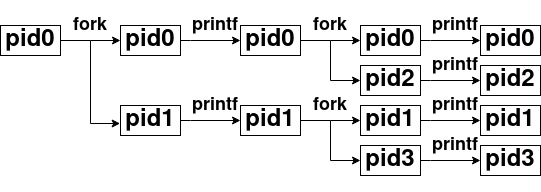
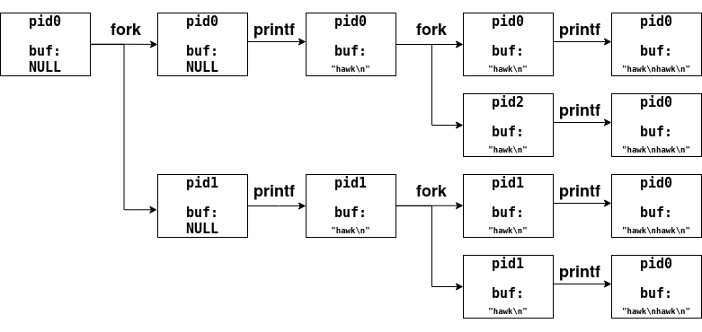
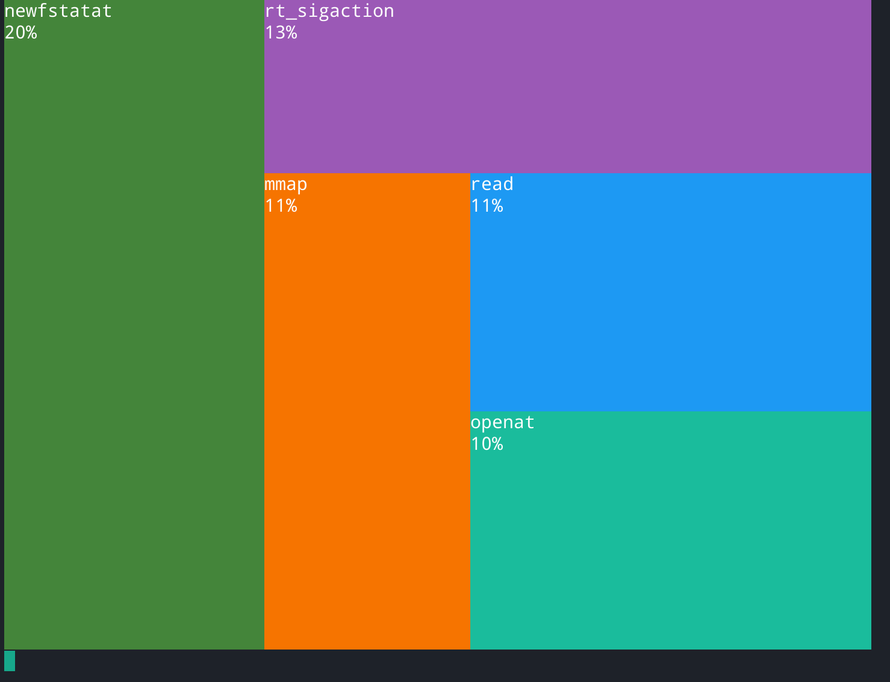

# 前言

这几节课加深了对于操作系统的某些方面的了解，下面简单介绍一下进程抽象的相关问题，并实现课程中的M3实验

# 进程抽象

## fork系统调用

之前我们一直将进程当作一个**状态机**。那么如果我们想要创建一个新的进程，也就是创建一个新的**状态机**即可。

在Linux中，操作系统提供了**fork**系统调用，其会将当前的进程，即当前的状态机(包括内存和寄存器)，完整的复制一份，从而创建了新的进程。

具体的，可以根据**man 2 fork**，查看接口信息，如下所示

```c
#include <unistd.h>

/*
On success, the PID of the child process is returned in the parent,  and  0  is
returned  in  the  child.   On  failure, -1 is returned in the parent, no child
process is created, and errno is set to indicate the error.
*/

pid_t fork(void);
```

### fork bomb

自然的，我们可以想到，操作系统管理进程是需要资源的。那么理论上，我们只要不停地创建进程，系统最后会因为资源耗尽而崩溃。
基于这个原理，有一个经典的命令——**fork bomb**，其会以指数级别的增长速度创建进程，从而使进程崩溃。

**fork bomb**的经典命令格式如下所示

```bash
$ :(){:|:&};:
```

可以看到，这个命令有点**tricky**，我们简单的分析一下该命令。

首先，在bash中，`:`可以作为标识符，也就是其可以作为一个符号，那我们将其更换为一个更美观的标识符**fork**，转换后的命令如下

```
fork(){fork|fork&};fork
```

此时可以大致看出来，这就是定义了一个函数，然后在进行调用即可。**bash**中的分号表示一个换行，这里我们在美化一下命令，添加适当的空白和换行，如下所示

```
fork() {
	fork | fork &
}
fork
```

可以看到，其以二的幂的增长速度创建进程，从而很快导致系统崩溃

### fork中的缓冲问题

实际上，虽然前面介绍**fork**的时候，只是简单的以**将当前的状态机(包括内存和寄存器)复制一份**介绍，但是中间有非常繁杂的细节，例如缓冲问题。

首先简单的分析一份代码，如下所示

```c
#include <stdio.h>
#include <unistd.h>

int main() {
	for(int i = 0; i < 2; ++i) {
		fork();
		printf("hawk\n");
	}
}
```

这份代码分析起来并不是很复杂，我们只要根据状态机理论，画一个状态图即可，如下所示



可以看到，从理论上进行分析，最后该程序应该会执行6次**printf**，那么程序总共会在终端上输出6行**hawk**。但是我们进行如下测试，会得到匪夷所思的结果

```bash
$ ./fork-printf 
hawk
hawk
hawk
hawk
hawk
hawk
$ ./fork-printf | wc -l
8
```

如果直接输出，程序确实是预期的结果;但如果我们将输出重定向，则其反而会输出8行**hawk**，与预期不同
实际上，这就是缓冲导致的问题——正常情况下，glibc是行缓冲:即遇到’\n’，就将缓冲区输出到标准输出上;而当我们使用管道后，管道还会使用自己的缓冲区，可以通过**ulimit -a | grep “pipe size”**查看缓冲区大小。
结合这个问题，实际上可以很好进行分析——即在复制状态机的状态时，其会将内存和寄存器等一并进行复制，而缓冲区也是存在于内存中的，自然也会一并复制过来，从而导致这个问题。具体的我们仍然可以结合状态图进行分析。



可以看到，如果考虑到缓冲的话，其确实会输出8行**hawk**。

为了确认我们的猜想，执行如下命令进行验证

```bash
$ (stdbuf -o0 ./fork-printf) | wc -l
6
```

## execve系统调用

当我们想要创建一个新线程，我们可能需要其执行其他的命令。此时，仅仅用**fork**系统调用是不够的，还需要用**execve**系统调用，将当前的状态机状态重置成另一个程序的初始状态。

类似于**fork**，我们可以通过**man 2 execve**查看该系统调用的接口信息，如下所示

```c
#include <unistd.h>


/*       
       execve() executes the program referred to by pathname.  This causes the program
       that is currently being run by the calling process to be replaced  with  a  new
       program,  with  newly  initialized stack, heap, and (initialized and uninitial‐
       ized) data segments.
*/
int execve(const char *pathname, char *const argv[], char *const envp[]);


/*
       pathname must be either a binary executable, or a script starting with  a  line
       of the form:

           #!interpreter [optional-arg]

       For details of the latter case, see "Interpreter scripts" below.

       

       argv  is  an array of pointers to strings passed to the new program as its com‐
       mand-line arguments.  By convention, the first of these strings (i.e., argv[0])
       should  contain the filename associated with the file being executed.  The argv
       array must be terminated by  a  NULL  pointer.   (Thus,  in  the  new  program,
       argv[argc] will be NULL.)


       envp  is an array of pointers to strings, conventionally of the form key=value,
       which are passed as the environment of the new program.  The envp array must be
       terminated by a NULL pointer.
*/
```

## _exit系统调用

理论上，当我们有了**fork**、**execve**系统调用后，我们就可以自由的执行任意程序了。虽然如此，但我们还需要一个系统调用，用来中止当前的状态机(状态机自身只能不停的跳转到下一个状态)。

Linux为此提供了**_exit()**系统调用，用来立即销毁当前进程，或者说是状态机。同样的，可以通过**man 2 _exit**查看该系统调用的接口信息，如下所示

```c
#include <unistd.h>

/*
	   _exit()  terminates  the calling process "immediately".  Any open file descrip‐
       tors belonging to the process are closed.  Any children of the process are  in‐
       herited  by  init(1)  (or by the nearest "subreaper" process as defined through
       the use of the prctl(2) PR_SET_CHILD_SUBREAPER operation).  The process's  par‐
       ent is sent a SIGCHLD signal.
*/
noreturn void _exit(int status);


/*

C library/kernel differences
       In  glibc  up  to  version 2.3, the _exit() wrapper function invoked the kernel
       system call of the same name.  Since glibc 2.3, the  wrapper  function  invokes
       exit_group(2), in order to terminate all of the threads in a process.

       The  raw  _exit()  system  call terminates only the calling thread, and actions
       such as reparenting child processes or sending SIGCHLD to  the  parent  process
       are performed only if this is the last thread in the thread group.
*/
```

# M3系统调用Profiler(sperf)

## 实验背景

**程序就是一个状态机**，而操作系统上的程序又通过**系统调用**和操作系统交互。

虽然如此，如果不看看实际程序执行的系统调用，对操作系统的理解仍然是很片面的。

所幸操作系统提供了足够的工具来查看——即追踪工具**trace**。**trace**工具是系统编程时非常常用的问题诊断工具。根据调试理论，**trace**在一定程度上反映了程序执行的流程，因此可以帮助你缩小bug所在的范围;此外，**trace**中额外的信息还能帮助诊断性能等问题。

如果我们对**trace**进行一定的分析，就可以将其结果更优美的进行展示。在本次实验中，可以借助**strace**实现一个程序的**性能诊断**工具，其可以通过分析**trace**的输出，从而分析系统调用的性能信息

## 实验描述

> 实现命令行工具*sperf*:
>
> sperf COMMAND [ARG] ...
>
> 其会在系统中执行**COMMAND**命令(如果**COMMAND**是以/开头的绝对路径，则直接执行;否则在**PATH**环境变量中搜索到第一个存在且可执行的文件)，并为**COMMAND**传入ARG参数，然后统计命令执行的系统调用所占用时间，最后在屏幕上显示出耗时最多的若干个系统调用的时间
> 一些假设和约定:
>
> - 输出的形式不限。对于较短时间运行的程序，可以一次性打印出耗时最多的几个系统调用;对于耗时较长的程序，需要定期(如每秒)打印出系统调用的耗时信息;
> - 假设**COMMAND**是单进程、单线程的，无需处理多进程和多线程的情况
> - 必须使用**execve**系统调用，而非**glibc**对于**execve**的包装(如**execl**、**execlp**、**execle**、**execv**、**execvp**或**execvpe**)

## 实验指南

在该实验中，其大体上可以分为三个部分

1. 创建子进程，在子进程中启动**strace**(通过**fork**/**execve**系统调用)
2. 在父进程中捕获**strace**的输出(通过**pipe**系统调用)
3. 解析捕获的**strace**输出，并把系统调用的时间信息统计显示

### 显示系统调用序列

在该实验中，我们只需要通过**strace**，就可以方便的查看整个程序从**头**开始的按顺序的一系列的系统调用
因此，本质上，该实验就是解析**strace**的输出

### 显示系统调用的时间(strace)

根据实验要求，我们不仅需要分析程序的系统调用的序列，还需要统计每一个系统调用的时间占比。而这也就是要求**strace**输出中也应该包含每一次系统调用所消耗的时间。

通过`man strace`可以很轻易的查到如下的信息

```
--syscall-times[=precision]
                   Show the time spent in system calls.  This records the time difference between the
                   beginning  and  the  end of each system call.  precision can be one of s (for sec‐
                   onds), ms (milliseconds), us (microseconds), or ns (nanoseconds), and allows  set‐
                   ting the precision of time value being printed.  Default is us (microseconds).
```

因此，我们在调用**strace**时，添加相关的参数即可

~~实际上在man中可以直接找到输出系统调用及其时间百分比的参数，即`strace -cU time-percent`, 但是有点作弊~~

### spert:设计

类似于前面的M1实验——其将**pstree**分解成多个更简单的子部分进行解决;这里也将**sperf**分解成几个更为简单的部件进行解决。

1. 解析出**COMMAND**和**ARG**——就是**main**的相关参数

2. 使用 **fork** 创建一个新的进程:

    1. 子进程使用 `execve`调用 `strace COMMAND ARG ...`，启动一份 **strace**

        - 在`execve`成功返回以后，子进程已经不再受控制了。`strace`会不断输出系统调用的trace，直到程序结束。当然，COMMAND命令不结束，`strace`也不会结束
    2. 父进程想办法不断读取`strace`的输出，直到**strace**程序结束

        - 能读取到输出，就可以解析出每个系统调用的时间，从而把统计信息打印到屏幕上

### 使用execve创建子进程

实验中已经明确要求了，必须使用`execve`执行程序，因此我们需要通过`man 2 execve`详细了解一下该函数的信息，其内容如下所示

```c
#include <unistd.h>

int execve(const char *pathname, char *const argv[],
           char *const envp[]);
```

这里可能会有几个问题:

1. **pathname**是相对于进程的当前目录(**current working directory**)而言的，或者是一个绝对路径。如果错误的传入可执行文件路径，则**execve**无法正确执行
2. 传入正确的**argv**。在课件中实际上有一个非常优美的写法
3. 传入正确的**envp**。部分程序的运行依赖于正确的环境变量，否则可能导致程序的异常

### 连接父子进程的输入

使用`pipe`系统调用，可以创建一个管道，通过`man 2 pipe`查看该系统调用的详细信息，如下所示

```c
#include <unistd.h>

int pipe(int pipefd[2]);

/*
       pipe()  creates  a  pipe, a unidirectional data channel that can be used for interprocess communication.  The array pipefd is used to return two file descriptors referring to the ends of the
       pipe.  pipefd[0] refers to the read end of the pipe.  pipefd[1] refers to the write end of the pipe.  Data written to the write end of the pipe is buffered by the kernel  until  it  is  read
       from the read end of the pipe.  For further details, see pipe(7).


       On success, zero is returned.  On error, -1 is returned, errno is set appropriately, and pipefd is left unchanged.
       On Linux (and other systems), pipe() does not modify pipefd on failure.  A requirement standardizing this behavior was added in POSIX.1-2016.  The Linux-specific pipe2() system call likewise
       does not modify pipefd on failure.
*/
```

`man`手册中也给出了相关的使用样例，如下所示

```c
#include <sys/types.h>
#include <sys/wait.h>
#include <stdio.h>
#include <stdlib.h>
#include <unistd.h>
#include <string.h>

int
main(int argc, char *argv[])
{
    int pipefd[2];
    pid_t cpid;
    char buf;

    if (argc != 2) {
        fprintf(stderr, "Usage: %s <string>\n", argv[0]);
        exit(EXIT_FAILURE);
    }

    if (pipe(pipefd) == -1) {
        perror("pipe");
        exit(EXIT_FAILURE);
    }

    cpid = fork();
    if (cpid == -1) {
        perror("fork");
        exit(EXIT_FAILURE);
    }

    if (cpid == 0) {    /* Child reads from pipe */
        close(pipefd[1]);          /* Close unused write end */

        while (read(pipefd[0], &buf, 1) > 0)
            write(STDOUT_FILENO, &buf, 1);

        write(STDOUT_FILENO, "\n", 1);
        close(pipefd[0]);
        _exit(EXIT_SUCCESS);

    } else {            /* Parent writes argv[1] to pipe */
        close(pipefd[0]);          /* Close unused read end */
        write(pipefd[1], argv[1], strlen(argv[1]));
        close(pipefd[1]);          /* Reader will see EOF */
        wait(NULL);                /* Wait for child */
        exit(EXIT_SUCCESS);
    }
}
```

可以看到，使用**pipefd**，和使用普通的文件描述符没有什么区别——只不过**pipefd**指定了`pipefd[0]`只能读;`pipefd[1]`只能写

实验指南中还额外指明了，可能需要**dup2**系统调用进行文件描述符的腾挪，这里同样通过`man 2 dup2`，查看该系统调用的相关信息

```c
#include <unistd.h>

int dup(int oldfd);
/*

       The dup() system call creates a copy of the file descriptor oldfd, using the lowest-numbered unused file descriptor for the new descriptor.

       After  a successful return, the old and new file descriptors may be used interchangeably.  They refer to the same open file description (see open(2)) and thus share file offset and file sta‐
       tus flags; for example, if the file offset is modified by using lseek(2) on one of the file descriptors, the offset is also changed for the other.

       The two file descriptors do not share file descriptor flags (the close-on-exec flag).  The close-on-exec flag (FD_CLOEXEC; see fcntl(2)) for the duplicate descriptor is off.
*/


int dup2(int oldfd, int newfd);
/*
       The dup2() system call performs the same task as dup(), but instead of using the lowest-numbered unused file descriptor, it uses the file descriptor number specified in newfd.  If  the  file
       descriptor newfd was previously open, it is silently closed before being reused.

       The  steps  of closing and reusing the file descriptor newfd are performed atomically.  This is important, because trying to implement equivalent functionality using close(2) and dup() would
       be subject to race conditions, whereby newfd might be reused between the two steps.  Such reuse could happen because the main program is interrupted by a signal handler that allocates a file
       descriptor, or because a parallel thread allocates a file descriptor.

       Note the following points:

       *  If oldfd is not a valid file descriptor, then the call fails, and newfd is not closed.

       *  If oldfd is a valid file descriptor, and newfd has the same value as oldfd, then dup2() does nothing, and returns newfd.
*/
```

实际上，也就是用来重定向文件描述符的系统调用

### 解析strace的输出

实际上，**strace**的输出类似于一行c函数的调用，因此解析**strace**的输出，也就相当于一个**字符串处理**类型的问题。

因此最方便的办法自然是通过正则表达式进行解析，可以通过`man 3 regex`查看相关的文档信息

```c
#include <sys/types.h>
#include <regex.h>

int regcomp(regex_t *preg, const char *regex, int cflags);
/*
       regcomp() is used to compile a regular expression into a form that is suitable for subsequent regexec() searches.
       regcomp() is supplied with preg, a pointer to a pattern buffer storage area; regex, a pointer to the null-terminated string and cflags, flags used to determine the type of compilation.
       All regular expression searching must be done via a compiled pattern buffer, thus regexec() must always be supplied with the address of a regcomp() initialized pattern buffer.
       cflags may be the bitwise-or of zero or more:
*/


int regexec(const regex_t *preg, const char *string, size_t nmatch,
            regmatch_t pmatch[], int eflags);
/*
       regexec()  is  used  to match a null-terminated string against the precompiled pattern buffer, preg.  nmatch and pmatch are used to provide information regarding the location of any matches.
       eflags may be the bitwise-or of one or both of REG_NOTBOL and REG_NOTEOL which cause changes in matching behavior.
*/


size_t regerror(int errcode, const regex_t *preg, char *errbuf,
                size_t errbuf_size);
/*
       regerror() is used to turn the error codes that can be returned by both regcomp() and regexec() into error message strings.
       regerror() is passed the error code, errcode, the pattern buffer, preg, a pointer to a character string buffer, errbuf, and the size of the string buffer, errbuf_size.  It returns  the  size
       of  the errbuf required to contain the null-terminated error message string.  If both errbuf and errbuf_size are nonzero, errbuf is filled in with the first errbuf_size - 1 characters of the
       error message and a terminating null byte ('\0').
*/


void regfree(regex_t *preg);
/*
       Supplying regfree() with a precompiled pattern buffer, preg will free the memory allocated to the pattern buffer by the compiling process, regcomp().
*/
```

可以看到，首先需要进行正则表达式的预编译，然后再执行匹配过程，最后释放掉预编译所占用的空间。具体的细节可以查看手册了解

当然，在解析strace的输出时，会遇到一些小麻烦，如下所示

1. **strace**默认会将**trace**输出到**stderr**中。但如果**strace**追踪的程序同样输出到**stderr**，则会对解析**strace**的输出产生一些麻烦

2. 即使解决了上面的问题(例如将程序的 **stderr** 重定向到 **/dev/null** 丢弃)，程序输出的字符串同样可能对解析产生麻烦，如下所示

    ```bash
$ strace -T echo -n '", 1) = 100 <99999.9>' > /dev/null
    ioctl(1, TCGETS, 0x7fff80723570)        = -1 ENOTTY <0.000100>
write(1, "\", 1) = 100 <99999.9>", 21)  = 21 <0.000149>
    close(1)                                = 0 <0.000126>
```

### 图形化展示

最后，当我们获取了每个系统调用所花的总时间后，就可以使用[ANSI Escape Code](https://notes.burke.libbey.me/ansi-escape-codes/)，打印出一张图形化界面——只需要每个一段时间使用ANSI Escape Code清一下屏幕即可

额外说明一下，实际上，在学会使用**Escape Code**之后，就打开了一扇新的大门，只需要两个额外的API，既可以实现任何有趣的东西

1. 准确的定时器;
2. 能够即刻捕获终端按键的API

## 实验环境

### 解析COMMAND、ARG和环境变量

对于COMMAND，根据实验手册可知，其是第一个参数，即**main**的`argv[1]`为COMMAND。实际上其并不需要进行解析——因为我们会调用`execve(/path/to/strace, sperf_args, sperf_env)`，实际上**sperf_args[1]**的值就是COMMAND。那么只要我们传递正确的**sperf_env**，则执行execve的时候，其会自动进行解析

对于ARG，实际上就是`argv[2:]`,其中**argv[0] == sperf**,**argv[1] == COMMAND**;另一方面，由于我们还需要输出系统调用的时间信息，即我们还需要在额外添加**-T**参数；最后，为了避免**strace**的输出和**strace**追踪的程序的输出混合，我们还需要参数**-o**、**/proc/`pid`/fd**来直接指定strace的输出

最后则是环境变量，实际上根据手册`man 7 environ`可知，其是操作系统直接定义好的变量，如下所示

```c
#include <unistd.h>
extern char **environ;

/*
The variable environ points to an array of pointers to strings called the "environment".  The last pointer in this array has the value NULL.  (This variable must be declared in the user pro‐
       gram, but is declared in the header file <unistd.h> if the _GNU_SOURCE feature test macro is defined.)
*/
```


因此，我们不需要更多的解析，直接使用即可

最后，解析COMMAND、ARG和环境变量部分的代码如下所示

```c
// strace显示系统调用时间的参数
char *STRACE_SHOW_TIME = "-T", *STRACE_OUTPUT = "-o";

// glibc中定义好的环境变量
extern char **environ;

/*
 * 实际上glibc已经提前解析好环境变量，不需要过多在进行解析
 * 对于参数，只需要添加-T,显示具体的系统调用的时间即可
 */
char **parse_args_environ(int argc, char *argv[]) {
	char **exec_arg = (char**)malloc(sizeof(char*) * (argc + 4));
	assert(exec_arg && argv);


	//exec_arg[0] = STRACE_PATH, exec_arg[1] = STRACE_SHOW_TIME, exec_arg[2] = "-o", exec_arg[3] = /proc/`pid`/fd, exec_arg[4:] = argv[1:]
	//首先直接复制原始的argv即可，之后会用strace的路径替换exec_arg[0],因此没有必要进行复制
	exec_arg[1] = STRACE_SHOW_TIME;
	exec_arg[2] = STRACE_OUTPUT;
	for(int i = 1; i <= argc; ++i) { exec_arg[i + 3] = argv[i]; }

	return exec_arg;
}
```

### fork创建子进程

实际上，也就是创建新进程，一个进程用来执行**/path/to/strace -T -o /proc/`pid`/fd COMMAND arg**，即不断输出系统调用的相关情况；另一个进程用来分析上一个进程的输出，并对其解析，然后通过图形化界面进行表示即可

这一部分的工作很简单，就是通过**fork**生成新的进程，其中为了方便，子进程(返回值为0的进程)作为前面介绍的第一个进程进行执行；而父进程(返回值为1的进程)自然作为后一个进程进行执行即可。

需要说明的是，由于之后涉及两个进程之间的通信，因此需要首先调用**pipe**，生成一端读、一端写的管道。然后**fork**后，两个进程都继承了管道文件描述符，则可以通过管道进行通信——这里子进程只涉及输出信息，因此其可以关闭用来读取的文件描述符，然后将**stderr**重定向到管道的输出文件描述符上即可;类似的，对于父进程，其只需要从用来读取的文件描述符中读入数据即可。这部分的代码如下所示

```c
//管道文件描述符，用来进程间通信
int pipefd[2] = {0};

int main(int argc, char *argv[]) {

	//提前创建管道文件描述符，用来之后进程间通信
	if(pipe(pipefd) == -1) {
		perror("pipe");
		exit(EXIT_FAILURE);
	}
	

	//创建新进程，其中子进程用来执行/path/to/strace -T -o /proc/`pid`/fd
	switch(fork()) {
		case -1:
			perror("fork");
			exit(EXIT_FAILURE);
			break;
		case 0:
			child(argc, argv);
			break;
		default:
			parent();

	}

	/*
	 * 理论上，child由于执行execve，则其不会返回，即不可能执行到这里
	 * parent由于在read系统调用异常时，会直接返回，也不可能执行到这里
	 */
	fprintf(stderr, "%s\n", "sperf wrong return");
	fflush(stderr);
	exit(EXIT_FAILURE);
}
```

### 子进程execve调用strace

下面具体说明一下子进程的函数逻辑

首先，子进程仅仅需要将**strace**的结果输出到管道的写入部分，因此其首先关闭管道的读文件描述符。

其次，其需要解析**COMMAND**和**arg**，这个在前面已经简单介绍过了。但是这里需要设置**arg[0]**和**arg[3]**，一个是**strace**的路径，这个在下面的步骤中会提及；另一个是子进程的写管道文件描述符，由于**strace**默认输出到**stdout**，可能和程序输出混合，因此将其重定向到**/proc/`pid`/fd**(一开始思想太僵化，看到了**-o**可以指定**strace**输出文件，但是没有和**procfs**联系起来，这里是看了**jyy**老师的github才明白，还是太菜了😢)

最后，为了获取有效的**strace**路径信息，则我们需要依次使用`execve`实验**PATH**环境变量，找到其有效路径。通过查阅手册`man 3 getenv`可知，可以通过**getenv**函数获取环境变量，如下所示

```c
#include <stdlib.h>

char *getenv(const char *name);
/*
The getenv() function searches the environment list to find the environment variable name, and returns a pointer to the corresponding value string.
*/
```

Linux中PATH变量通过**:**进行分割，因此我们只需要根据**:**切割获取的环境变量，并依次遍历这些路径，执行**execve**则可以找到**strace**文件所在的路径。这部分的代码如下所示

```c
/*
 * 子进程部分
 * 其用来执行/path/to/strace -T -o /proc/`pid`/fd command arg
 */
void child(int argc, char *argv[]) {

	char fd_path[20] = {0}, strace_path[MAX_STRACE_OUTPUT_SIZE] = {0}; // Linux中路径长度最大不超过MAX_STRACE_OUTPUT_SIZE字符

	// 首先关闭读管道文件描述符
	close(pipefd[0]);


	// 获取部分参数
	char **exec_arg = parse_args_environ(argc, argv);


	// 获取exec_arg[3], 即当前进程的写管道描述符
	exec_arg[3] = fd_path;
	sprintf(fd_path, "/proc/%d/fd/%d", getpid(), pipefd[1]);


	//开始根据环境变量中的PATH值进行切割和测试，从而获取strace的路径信息和exec_arg[0]
	exec_arg[0] = strace_path;
	int pathBegin = 0, i = 0;
	char *path = getenv("PATH");

	while(path[i]) {
		while(path[i] && path[i] != PATH_SPLIT) { ++i; }

		// 此时path[pathBegin: i - 1]就是待检测的路径
		strncpy(strace_path, path + pathBegin, i - pathBegin);
		strncpy(strace_path + i - pathBegin, STRACE_EXECUTE, sizeof(STRACE_EXECUTE) +1);

		execve(strace_path, exec_arg, environ);	//如果正确执行，则不会返回，并且将strace输出到写管道描述符

		pathBegin = ++i;
	}


	// 如果执行了execve，则理论上不会执行到这里——也就是如果执行到了这里，必然是execve没有正确执行
	fprintf(stderr, "%s\n", "execve() could not find strace");
	fflush(stderr);
	exit(EXIT_FAILURE);
}
```

### 父进程获取管道输出

对于父进程来说，这部分的任务可以简单分为两部分——从读管道文件描述符中读取子进程的输出、使用正则表达式解析该输出并进行结果统计
第一个任务还是比较简单的——只需要循环调用`read`读取管道符即可。这里面有几个小细节:

1. 设置缓冲区大小。我们并不知道子进程每次输出的大小，理论上应该使用动态数组进行存储。这里为了简单~~懒得实现~~，直接固定长度**4192**个字节即可

2. 注意 **read** 的结果，我们需要 **read** 命令的结果，判断子进程的状态 根据 `man 3 read`，首先，将读管道文件描述符设置为 **O_NONBLOCK**，从而可以根据 **read** 的结果判断子进程调用

    - 如果**read**结果等于-1，则表示子进程未结束，但是当前子进程无输出

    - 如果 **read** 结果等于0，则表示子进程已经结束

        - 如果**read**结果大于0，则表明子进程正常输出

这一部分的最终代码如下所示

```c
#define TIME_INTERVAL_SECONDS (1)
#define MAX_STRACE_OUTPUT_SIZE (4095)

/*
 * 父进程部分
 * 其解析子进程的管道输出，并且以GUI的形式展示输出
 */
void parent(void) {
	char buf[MAX_STRACE_OUTPUT_SIZE + 1] = {0};
	int read_result = 0, buf_available = 0;


	//关闭无用的写管道文件描述符
	close(pipefd[1]);


	//设置读管道文件描述符为非阻塞模式
	if(fcntl(pipefd[0], F_SETFD, fcntl(pipefd[0], F_GETFD) | O_NONBLOCK) == -1) {
		perror("fcntl");
		exit(EXIT_FAILURE);
	}


	//初始化解析字符串中正则匹配相关模式
	parse_strace_output_init();
	
	

	while(1) {

		//可能子进程确实没有输出，或子进程终止，需要辨别这两种情况
		switch(read_result = read(pipefd[0], buf + buf_available, MAX_STRACE_OUTPUT_SIZE - buf_available)) {
			//子进程当前没有输出，但未终止
			case -1:
				break;
			//子进程当前终止
			case 0:
				exit(EXIT_SUCCESS);
				break;
			//此时子进程和父进程正常通过管道进行通信
			default:
				buf[buf_available + read_result] = 0;
				buf_available = parse_strace_output(buf, buf_available + read_result);
		}


		// 节省资源，休眠TIME_INTERVAL_SECONDS秒
		sleep(TIME_INTERVAL_SECONDS);
	}
}
```

### 父进程解析管道输出

首先，需要考虑如何统计管道输出。这里需要三个数据结构——一个统计系统调用名称及其消耗时间的数据结构、一个按照系统调用名称排序的数组和一个按照消耗时间排序的数组，并保持相关的排序顺序不变，如下所示

```c
/*
 * 用来统计系统调用的信息
 */
#define SYSCALL_SIZE	(400)
typedef struct SYSCALL_INFO {
	const char *syscall;
	int syscall_name_size;
	long long time;
} Syscall_Info;
Syscall_Info *syscall_info_sort_by_name[SYSCALL_SIZE] = {NULL}, *syscall_info_sort_by_time[SYSCALL_SIZE] = {NULL};
int syscall_info_number = 0;
long long syscall_time_total = 0;
```

既然有了上面的系统调用统计信息的数据结构，则自然需要实现基于该数据结构的操作——即每解析一条输出，增加一次相关系统调用的统计信息，如下所示

```c
/*
 * 根据系统调用字符串，查找syscall_info_sort_by_name数组，从而获取字符串数组所在的下标
 */
int syscall_info_find_idx_by_name(const char *name) {
	int left = 0, right = syscall_info_number - 1;
	while(left <= right) {
		int middle = left + (right - left) / 2, cmp = strcmp(syscall_info_sort_by_name[middle]->syscall, name);
		if(cmp == 0) { return middle; }
		else if(cmp < 0) { left = middle + 1; }
		else { right = middle - 1; }
	}
	return -1;
}


/*
 * 根据系统调用，排序名称或者消耗时间
 * 快排
 */
#define syscall_info_sort_by_name_sort() _syscall_info_qsort(syscall_info_sort_by_name, 0, syscall_info_number - 1, syscall_info_sort_by_name_cmp)
#define syscall_info_sort_by_time_sort() _syscall_info_qsort(syscall_info_sort_by_time, 0, syscall_info_number - 1, syscall_info_sort_by_time_cmp)
void _syscall_info_qsort(Syscall_Info **base, int left, int right, int (*cmp)(Syscall_Info **base, int i, int j)) {
	if(left >= right) { return; }

	int leftIndex = left, rightIndex = right + 1;
	Syscall_Info *temp = NULL;

	while(1) {
		while((*cmp)(base, left, ++leftIndex) > 0) {
			if(leftIndex == right) { break; }
		}

		//为了确保正确性，不能为等号，否则rightIndex可能取到left - 1
		while((*cmp)(base, left, --rightIndex) < 0) {;}

		if(leftIndex >= rightIndex) { break; }

		temp = base[leftIndex];
		base[leftIndex] = base[rightIndex];
		base[rightIndex] = temp;
	}


	temp = base[left];
	base[left] = base[rightIndex];
	base[rightIndex] = temp;

	_syscall_info_qsort(base, left, rightIndex - 1, cmp);
	_syscall_info_qsort(base, rightIndex +1, right, cmp);
}


int syscall_info_sort_by_name_cmp(Syscall_Info **base, int i, int j) {
	return strcmp(base[i]->syscall, base[j]->syscall);
}

int syscall_info_sort_by_time_cmp(Syscall_Info **base, int i, int j) {
	//为了确保正确性，如果i == j，则应该返回0，否则qsort的rightIndex可能越界
	if(base[i]->time == base[j]->time) { return 0; }
	else if(base[i]->time > base[j]->time) { return -1; }
	return 1;
}


/*
 * 添加系统调用的相关信息，
 * 如果系统调用存在的话，直接增加其时间即可
 * 如果系统调用不存在的话，新创建
 * 插入完成后，完成相关的排序即可
 */
void syscall_info_insert_and_sort(const char *name, long long time) {

	syscall_time_total += time;

	int syscall_info_idx = 0;
	if((syscall_info_idx = syscall_info_find_idx_by_name(name)) == -1) {
		//此时系统调用信息不能存在，需要创建一个
		Syscall_Info *syscall_info = (Syscall_Info*)malloc(sizeof(Syscall_Info));
		syscall_info->syscall = name;
		syscall_info->syscall_name_size = strlen(name);
		syscall_info->time = time;

		syscall_info_sort_by_name[syscall_info_number] = syscall_info;
		syscall_info_sort_by_time[syscall_info_number++] = syscall_info;


		syscall_info_sort_by_name_sort();
		syscall_info_sort_by_time_sort();
	}else {
		//此时系统调用信息存在，直接修改并排序即可
		syscall_info_sort_by_name[syscall_info_idx]->time += time;
		syscall_info_sort_by_time_sort();
	}
}
```

最后，则是通过正则表达式捕获**strace**输出中的系统调用及其时间信息。由于系统调用名称总是位于每一行的开头，且第一次遇见**(**结束，则通过如下的正则表达式进行捕获即可`^[^\\(]+`;而对于系统调用所消耗的时间，其位于每一行的结尾，且在小数后紧跟着**>**，则通过如下正则表达式进行捕获即可`[0-9]+\\.[0-9]+>$`。则最终解析子进程的输出的相关代码如下所示

```c
/*
 * 通过正则匹配解析字符串的信息，从而获取所有的系统调用统计信息，并完成字符串和系统调用统计信息的更新
 * 这里由于可能字符串包含不完整的一行，则保留不完整的部分，并将其移动至行首即可
 */
regex_t regex_syscall, regex_time;
#define re_syscall ("^[^\\(]+")
#define re_time ("[0-9]+\\.[0-9]+>$")
void parse_strace_output_init(void) {
	if(regcomp(&regex_syscall, re_syscall, REG_EXTENDED | REG_NEWLINE)) {
		fprintf(stderr, "regcomp(&regex_syscall, re_syscall, REG_EXTENDED)\n");
		fflush(stderr);
		exit(EXIT_FAILURE);
	}

	if(regcomp(&regex_time, re_time, REG_EXTENDED | REG_NEWLINE)) {
		fprintf(stderr, "regcomp(&regex_time, re_time, REG_EXTENDED)\n");
		fflush(stderr);
		exit(EXIT_FAILURE);
	}
}


/*
 * 根据正则匹配时进行解析即可
 * 如果同时匹配到syscall和time，则完成更新后，继续下一次解析
 * 如果有任何一个未匹配，则从最后一次匹配的位置处，将其移动至行首,并返回剩余的字符串长度即可
 */
#define NS_TO_LONGLONG (1000000)
int parse_strace_output(char *buf, int buf_size) {
	if(buf_size == 0) { return 0; }

	double time = 0;
	regmatch_t pmatch[1];
	char *regex_syscall_so = buf, *regex_syscall_eo = buf, *regex_time_so = buf, *regex_time_eo = buf, regex_matched = 0;

	//开始进行匹配即可
	while(1) {
		if(regexec(&regex_syscall, regex_time_eo, sizeof(pmatch) / sizeof(pmatch[0]), pmatch, 0)) { break;}
		regex_syscall_so = regex_time_eo + pmatch[0].rm_so;
		regex_syscall_eo = regex_time_eo + pmatch[0].rm_eo;


		if(regexec(&regex_time, regex_syscall_eo, sizeof(pmatch) / sizeof(pmatch[0]), pmatch, 0)) { break;}
		regex_time_so = regex_syscall_eo + pmatch[0].rm_so;
		regex_time_eo = regex_syscall_eo + pmatch[0].rm_eo;


		regex_matched = 1;


		//截取系统调用名称
		int syscall_name_size = regex_syscall_eo - regex_syscall_so;
		char *syscall = (char*)malloc(sizeof(char) * (1 + syscall_name_size));
		memcpy(syscall, regex_syscall_so, syscall_name_size);
		syscall[syscall_name_size] = 0;

		//截取系统调用的消耗时间
		sscanf(regex_time_so, "%lf", &time);

		//添加该系统调用及其消耗时间统计
		syscall_info_insert_and_sort(syscall, time * NS_TO_LONGLONG);
	}


	//由于更新了系统调用的统计信息，因此更新其gui图像展示
	if(regex_matched) { syscall_info_display(); }


	//由于可能重叠，因此只能使用memmove，而非memcopy
	int remain_size = buf + buf_size - regex_time_eo;
	memmove(buf, regex_time_eo, remain_size);
	buf[remain_size] = 0;

	return remain_size;
}
```

### 图形化展示

有时，”面向终端编程”并不是十分的直观，并且十分枯燥。因此可以通过使用[ANSI Escape Code](https://segmentfault.com/a/1190000023553724)，设置字符的颜色和坐标，从而通过在字符终端里绘制系统调用图的方式展示系统调用的耗时(系统调用所花时间与所占面积成正比)，直观地展示系统调用信息
首先，为了美观，我们按照实验指南中的部分进行布局终端界面，如下所示


即top1的系统调用，其高和终端界面等高;top2的系统调用，其宽充满终端除了top1系统调用后剩余的宽;top3的系统调用，其高充满终端除了top2系统调用后剩余的高;top4的系统调用，其宽充满终端除了top1的系统调用和top3的系统调用后剩余的宽;最后top5的系统调用，其高充满终端除了top2的系统调用和top4的系统调用后剩余的高。

看着可能比较麻烦，实际上就是一道小的算法题:

1. 一方面，每一次切割给系统调用展示时，其都是切割的左侧/上侧的矩形，剩余的始终是右下角的矩形。因此，我们只要一直记录剩余矩形的左上角坐标，即可轻松的记录整个剩余可分割的部分
2. 在1.的基础上，如果通过**ANSI**实现了光标的相对位移的移动，则可以轻松的通过移动光标再输出，从而完成系统调用的分割和展示

> Talk is cheap, Show me the code
>
> **----Linus Torvalds**

直接展示代码可能理解起来更快

```c
/*
 * 将系统调用的统计信息以图形化的形式进行展示
 */
//根据实验指南说明，其为图像中展示的不同的系统调用的个数
#define SYSCALL_INFO_SHOW_SIZE (5)

//设置终端展示时候的窗口高
#define SYSCALL_INFO_WINDOW_HEIGHT (20)
//设置终端展示时候的窗口高
#define SYSCALL_INFO_WINDOW_WIDTH (40)

#define syscall_info_show_format(color) ("\e["#color";37m%s\e[0m")
const char *syscall_info_show_formats[SYSCALL_INFO_SHOW_SIZE] = {syscall_info_show_format(42), syscall_info_show_format(45), syscall_info_show_format(43), syscall_info_show_format(44), syscall_info_show_format(46)};
#define syscall_info_show(idx, str) (fprintf(stderr, syscall_info_show_formats[(idx)], (str)))

#define syscall_info_show_move(opcode) (fprintf(stderr, "\e[1"#opcode))
//将当前光标上移n行，列数不变
void syscall_info_show_move_up(int idx) {
	for(int i = 0; i < idx; ++i) { syscall_info_show_move(A); }
}
//将当前光标下移n行，列数不变
void syscall_info_show_move_down(int idx) {
	for(int i = 0; i < idx; ++i) { syscall_info_show_move(B); }
}
//将当前光标左移n列，行数不变
void syscall_info_show_move_left(int idx) {
	for(int i = 0; i < idx; ++i) { syscall_info_show_move(D); }
}
//将当前光标右移n列，行数不变
void syscall_info_show_move_right(int idx) {
	for(int i = 0; i < idx; ++i) { syscall_info_show_move(C); }
}
//将光标默认移动到第0行，第0列
#define syscall_info_show_position_init() (fprintf(stderr, "\e[0;0H"))


/*
 * 由于每次切割后,记录可用的矩阵的左上坐标即可
 * (row, col)
 * (0,0)			(0, width - 1)
 * _______________________________________
 * |					 |
 * |					 |
 * |_____________________________________|
 * (height - 1, 0)			(height - 1, witdh - 1)
 */
void syscall_info_display() {
	
	//为了使gui界面完整，界面左上角始终从(0， 0)开始
	syscall_info_show_position_init();


	int left_top_row = 0, left_top_col = 0, syscall_info_idx = 0, height = 0, width = 0;
	long long syscall_info_show_time_total = 0;


	//计算需要展示部分的总时间，方便统计每次切分窗口的大小
	for(int i = 0; i < SYSCALL_INFO_SHOW_SIZE && i < syscall_info_number; ++i) { syscall_info_show_time_total += syscall_info_sort_by_time[i]->time; }


	//为了避免留有空白，则最后一部分不需要进行切割，直接有多少切分多少;其余按照比例进行切割即可
	for(; syscall_info_idx + 1 < SYSCALL_INFO_SHOW_SIZE && syscall_info_idx + 1 < syscall_info_number; ++syscall_info_idx) {

		//此时其宽和窗口的宽等宽，高按照比例进行相关的切分
		if(syscall_info_idx & 1) {
			width = SYSCALL_INFO_WINDOW_WIDTH - left_top_col;
			height = (SYSCALL_INFO_WINDOW_HEIGHT - left_top_row) * (syscall_info_sort_by_time[syscall_info_idx]->time / (double)syscall_info_show_time_total);
		}else {
		//此时高和窗口的高等高，宽按照比例进行切分即可
			height = SYSCALL_INFO_WINDOW_HEIGHT - left_top_row;
			width = (SYSCALL_INFO_WINDOW_WIDTH - left_top_col) * (syscall_info_sort_by_time[syscall_info_idx]->time / (double)syscall_info_show_time_total);
		}
		syscall_info_show_time_total -= syscall_info_sort_by_time[syscall_info_idx]->time;


		//将[left_top_row, left_top_col] -> [left_top_row + height, left_top_col + width]为对角线的矩形进行上色即可
		int row_end = left_top_row + height, col_end = left_top_col + width;
		for(int row = left_top_row; row < row_end; ++row) {
			for(int col = left_top_col; col < col_end; ++col) { syscall_info_show(syscall_info_idx, " "); }
			syscall_info_show_move_down(1);
			syscall_info_show_move_left(width);
		}
		

		/*
		 * 输出系统调用及其消耗时间占比
		 * 名称位于第一行的最左侧
		 * 系统调用位于下一行的最左侧
		 */
		syscall_info_show_move_up(height);
		syscall_info_show(syscall_info_idx, syscall_info_sort_by_time[syscall_info_idx]->syscall);

		syscall_info_show_move_down(1);
		syscall_info_show_move_left(syscall_info_sort_by_time[syscall_info_idx]->syscall_name_size);

		char percentage[10] = {0};
		sprintf(percentage, "%2.0lf%%", syscall_info_sort_by_time[syscall_info_idx]->time / (double)syscall_time_total * 100);
		syscall_info_show(syscall_info_idx, percentage);

		//下一个从左下角开始
		if(syscall_info_idx & 1) {
			syscall_info_show_move_down(height - 1);	//即left_top_row + height - (left_top_row + 1)
			syscall_info_show_move_left(strlen(percentage));			//即left_top_col + strlen(percentage) - left_top_col

			left_top_row += height;
		}else {
		//下一个从右上角开始
			syscall_info_show_move_up(1);			//即left_top_row + 1 - left_top_row
			syscall_info_show_move_right(width - 3);	//即left_top_col + width - (left_top_col + strlen(percentage))
			left_top_col += width;
		}

	}


	// 输出最后一个需要展示的系统调用，这里将剩余的矩形全部分配给他即可
	height = SYSCALL_INFO_WINDOW_HEIGHT - left_top_row;
	width = SYSCALL_INFO_WINDOW_WIDTH - left_top_col;

	for(int row = left_top_row; row < SYSCALL_INFO_WINDOW_HEIGHT; ++row) {
		for(int col = left_top_col; col < SYSCALL_INFO_WINDOW_WIDTH; ++col) {syscall_info_show(syscall_info_idx, " "); }
		syscall_info_show_move_down(1);
		syscall_info_show_move_left(width);
	}

	/*
	 * 输出系统调用及其消耗时间占比
	 * 名称位于第一行的最左侧
	 * 系统调用位于下一行的最左侧
	 */
	syscall_info_show_move_up(height);

	syscall_info_show(syscall_info_idx, syscall_info_sort_by_time[syscall_info_idx]->syscall);
	syscall_info_show_move_down(1);
	syscall_info_show_move_left(syscall_info_sort_by_time[syscall_info_idx]->syscall_name_size);

	char percentage[10] = {0};
	sprintf(percentage, "%2.0lf%%", syscall_info_sort_by_time[syscall_info_idx]->time / (double)syscall_time_total * 100);
	syscall_info_show(syscall_info_idx, percentage);
	

	//为了位置gui界面的完整，这里将光标设置到gui界面的下一行行首开始输出
	syscall_info_show_move_down(SYSCALL_INFO_WINDOW_HEIGHT - left_top_row - 1);	//即SYSCALL_INFO_WINDOW_HEIGHT - (left_top_row + 1)
	syscall_info_show_move_left(left_top_col + strlen(percentage));				//即left_top_col + strlen(percentage) - 0


	//实验指南中，为了区分不同时刻的输出，添加的分界符号
	for(int i = 0; i < 80; ++i) { fprintf(stderr, "%c", '\x00'); }
	fflush(stderr);
}
```

## 实验结果

这里直接执行实验指南中测试的命令，即

```bash
./sperf-64 python -c '2**1000000' > /dev/null
```

实验结果如下图所示

